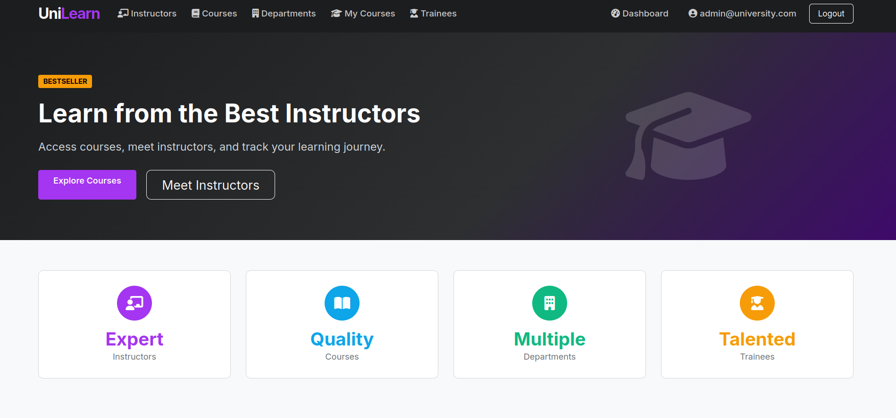
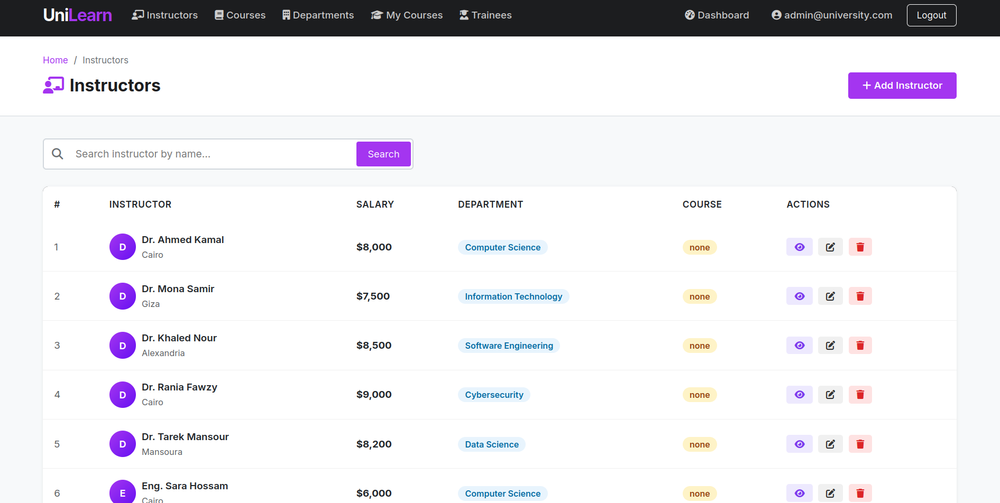
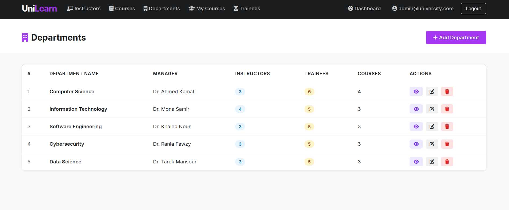

# UniLearn — University Management System

A full-featured **University Management System** built with ASP.NET Core MVC — inspired by Udemy's UI design. Manage Departments, Instructors, Courses, Trainees, and Student Enrollments with role-based access control.

---

## Screenshots

| Home | Instructors | Departments |
|------|-------------|-------------|
|  |  |  |

---

## Features

- **Authentication & Authorization** — ASP.NET Identity with cookie-based sessions
- **Role-Based Access** — `Admin` (full CRUD) and `Student` (browse & enroll)
- **Departments** — Manage departments with linked instructors, courses, and trainees
- **Instructors** — Full CRUD with photo upload and name search
- **Courses** — Browse and enroll; track credit hours per department
- **Trainees** — Admin-only management with course results (grades)
- **Enrollments** — Students enroll/unenroll; view grades in personal profile
- **Admin Dashboard** — High-level stats and quick management access
- **Image Uploads** — Profile photos for instructors and trainees

---

## Architecture
